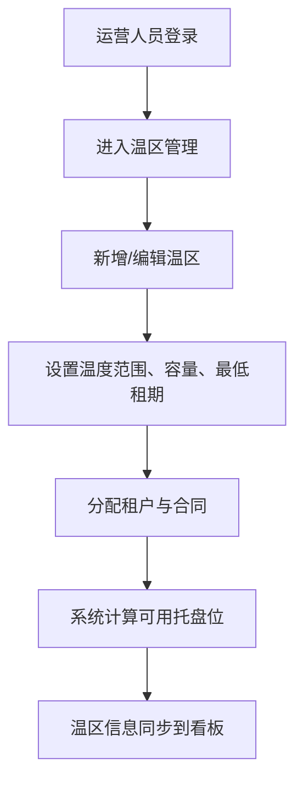
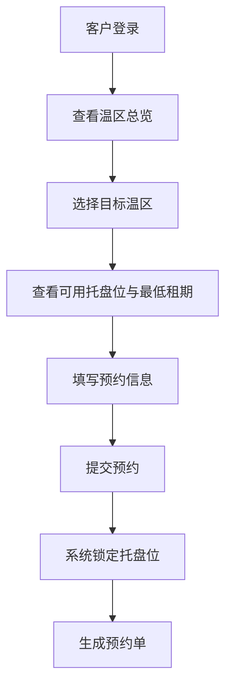
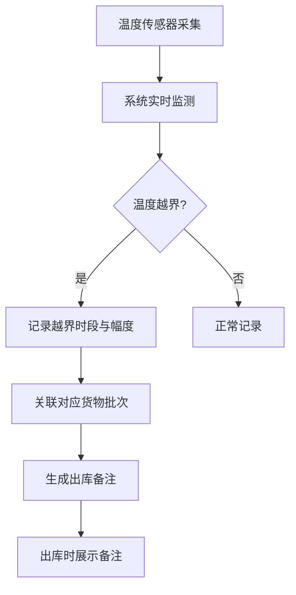

## 1. 产品概述

冷库温区租赁看板是面向冷链仓储运营的可视化管理系统，解决冷库多温区容量管理、租户合同管理、温度监控及客户预约入库等核心业务问题。通过直观的看板界面，运营人员可高效维护温区配置，客户可实时查看可用资源并提交预约。

- **目标用户**：冷库运营管理人员、仓储客户
- **核心价值**：提升冷库运营效率，透明化资源使用，保障冷链品质追溯

## 2. 核心功能

### 2.1 用户角色

| 角色 | 登录方式 | 核心权限 |
|------|----------|----------|
| 运营人员 | 账号登录 | 温区配置管理、租户合同管理、温度曲线维护、出库备注审核 |
| 客户 | 账号登录 | 查看可用托盘位、预约入库、查看在库货物温度记录 |

### 2.2 功能模块

1. **温区总览看板**：温区状态概览、容量使用率、温度实时监控
2. **温区管理**：温区基础信息维护、容量配置、租户分配、合同管理
3. **预约入库**：可用托盘位查询、最低租期提示、预约提交
4. **温度监控**：温度曲线展示、越界告警记录、出库备注关联

### 2.3 页面详情

| 页面名称 | 模块名称 | 功能描述 |
|----------|----------|----------|
| 温区总览 | 温区卡片列表 | 展示各温区温度、容量使用率、租户信息、合同状态 |
| 温区总览 | 温度趋势图 | 24小时温度曲线，标注越界点 |
| 温区管理 | 温区表单 | 新增/编辑温区：名称、温度范围、总托盘位、最低租期 |
| 温区管理 | 租户合同管理 | 租户信息、合同起止日期、租赁托盘位数 |
| 预约入库 | 温区选择 | 按温区展示可用托盘位、最低租期、参考价格 |
| 预约入库 | 预约表单 | 货物信息、入库日期、租期、托盘数量 |
| 温度监控 | 温度曲线 | 实时温度数据、上下限阈值、越界高亮 |
| 温度监控 | 出库备注 | 温度越界记录关联到对应批次货物，生成出库备注 |

## 3. 核心流程

### 3.1 运营人员温区配置流程

运营人员登录后进入温区管理页面，可新增或编辑温区信息，设置温度范围和总容量；为温区分配租户，录入合同起止日期和租赁托盘位数；系统自动计算剩余可用托盘位。

### 3.2 客户预约入库流程

客户登录后查看各温区可用托盘位和最低租期，选择目标温区后填写预约信息（货物名称、数量、入库日期、租期），提交后系统锁定对应托盘位并生成预约单。

### 3.3 温度越界与出库备注流程

温度传感器实时采集数据，系统持续监测是否越界；一旦越界，自动记录越界时段并关联到对应批次货物；货物出库时自动带出温度异常记录作为出库备注。

## 4. 用户界面设计

### 4.1 设计风格

- **主色调**：冷蓝色系（#1e3a5f 深蓝 / #0ea5e9 天蓝），体现冷链行业特性
- **辅助色**：温度告警色（#ef4444 红色高温告警 / #3b82f6 蓝色低温告警 / #10b981 绿色正常）
- **卡片风格**：圆角 12px，微阴影，玻璃拟态质感
- **字体**：标题使用 Space Grotesk，正文使用 Inter
- **布局**：顶部导航 + 侧边菜单 + 主内容区的经典后台布局

### 4.2 页面设计概述

| 页面名称 | 模块名称 | UI元素 |
|----------|----------|--------|
| 温区总览 | 温区卡片网格 | 卡片式布局，温度环形进度条，容量进度条，状态标签 |
| 温区总览 | 温度趋势图 | 折线图，渐变色填充，越界点红色标记 |
| 温区管理 | 数据表格 | 斑马纹表格，行内编辑，操作按钮组 |
| 温区管理 | 弹窗表单 | 模态框，分步表单，日期选择器 |
| 预约入库 | 温区选择卡 | 可用数量大字展示，最低租期标签，预约按钮 |
| 温度监控 | 曲线详情 | 双Y轴图表，阈值线，越界区间高亮 |
| 温度监控 | 出库备注列表 | 时间线布局，批次卡片，异常标记 |

### 4.3 响应式

- 桌面端优先设计（1440px）
- 平板端（768px）：侧边栏收起为图标菜单，卡片网格自适应列数
- 移动端（375px）：底部导航栏，卡片单列布局，表格横向滚动

### 4.4 动效设计

- 页面加载：元素渐入 + 轻微上移动画，stagger 延迟
- 温度数据：数字滚动动画，环形进度条渐变填充
- 卡片交互：悬停时轻微上浮 + 阴影加深
- 告警提示：脉冲呼吸动画，红色光晕效果
