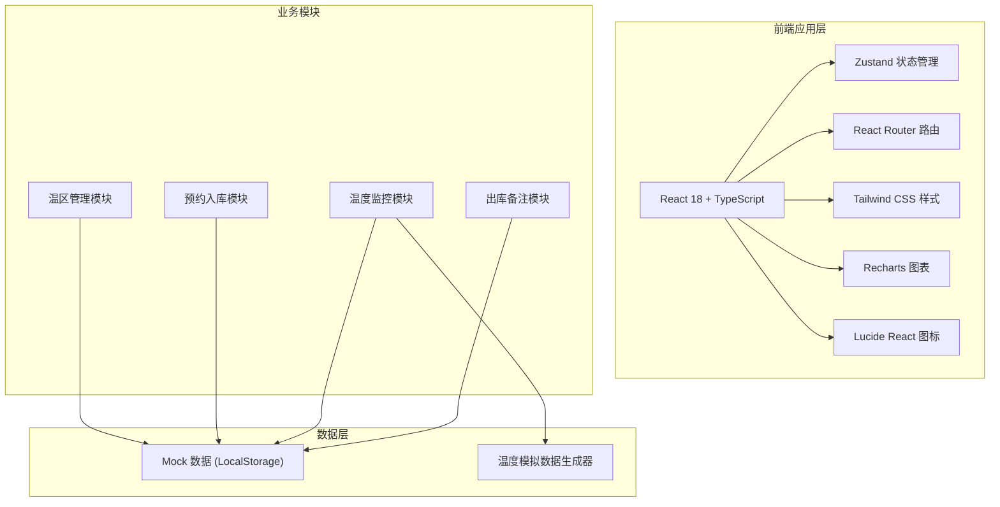
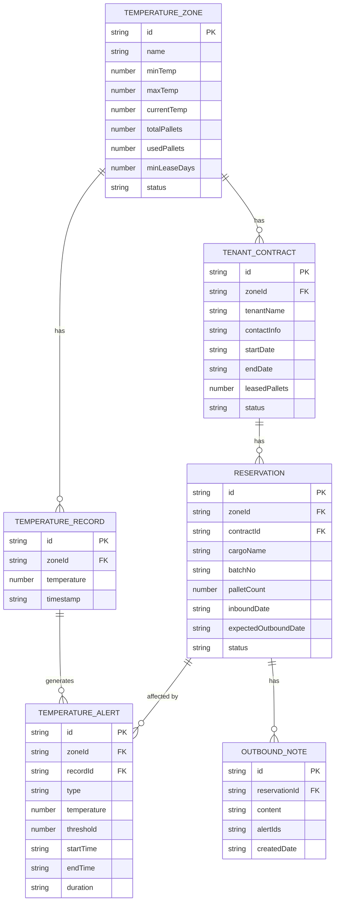

## 1. 架构设计



## 2. 技术描述

- **前端框架**：React@18 + TypeScript + Vite@5
- **状态管理**：Zustand@4
- **路由管理**：react-router-dom@6
- **样式方案**：tailwindcss@3
- **图表库**：recharts@2
- **图标库**：lucide-react
- **数据持久化**：LocalStorage + Mock 数据
- **初始化工具**：vite-init
- **后端**：无（纯前端应用，使用 Mock 数据模拟）

## 3. 路由定义

| 路由 | 页面 | 用途 |
|------|------|------|
| / | 温区总览 | 看板首页，展示所有温区概览信息 |
| /management | 温区管理 | 运营人员维护温区、租户、合同信息 |
| /reservation | 预约入库 | 客户查看可用托盘位并提交预约 |
| /monitor | 温度监控 | 温度曲线展示、越界记录、出库备注 |

## 4. 数据模型

### 4.1 数据模型定义



### 4.2 数据类型定义

```typescript
// 温区
interface TemperatureZone {
  id: string;
  name: string;
  minTemp: number;
  maxTemp: number;
  currentTemp: number;
  totalPallets: number;
  usedPallets: number;
  minLeaseDays: number;
  status: 'normal' | 'warning' | 'alert';
}

// 租户合同
interface TenantContract {
  id: string;
  zoneId: string;
  tenantName: string;
  contactInfo: string;
  startDate: string;
  endDate: string;
  leasedPallets: number;
  status: 'active' | 'expired' | 'pending';
}

// 预约入库
interface Reservation {
  id: string;
  zoneId: string;
  contractId: string;
  cargoName: string;
  batchNo: string;
  palletCount: number;
  inboundDate: string;
  expectedOutboundDate: string;
  status: 'pending' | 'in-stock' | 'outbound';
}

// 温度记录
interface TemperatureRecord {
  id: string;
  zoneId: string;
  temperature: number;
  timestamp: string;
}

// 温度告警
interface TemperatureAlert {
  id: string;
  zoneId: string;
  recordId: string;
  type: 'high' | 'low';
  temperature: number;
  threshold: number;
  startTime: string;
  endTime: string;
  duration: number;
}

// 出库备注
interface OutboundNote {
  id: string;
  reservationId: string;
  content: string;
  alertIds: string[];
  createdDate: string;
}
```

## 5. 模块结构

```
src/
├── components/        # 通用组件
│   ├── Layout/       # 布局组件
│   ├── Card/         # 卡片组件
│   ├── Chart/        # 图表组件
│   └── Modal/        # 弹窗组件
├── pages/            # 页面
│   ├── Dashboard/    # 温区总览
│   ├── Management/   # 温区管理
│   ├── Reservation/  # 预约入库
│   └── Monitor/      # 温度监控
├── store/            # Zustand 状态
├── utils/            # 工具函数
├── types/            # TypeScript 类型
├── data/             # Mock 数据
└── hooks/            # 自定义 Hooks
```

## 6. 状态管理设计

使用 Zustand 管理全局状态，按领域划分 store：

- **useZoneStore**：温区数据管理
- **useContractStore**：租户合同管理
- **useReservationStore**：预约入库管理
- **useTemperatureStore**：温度记录与告警管理
